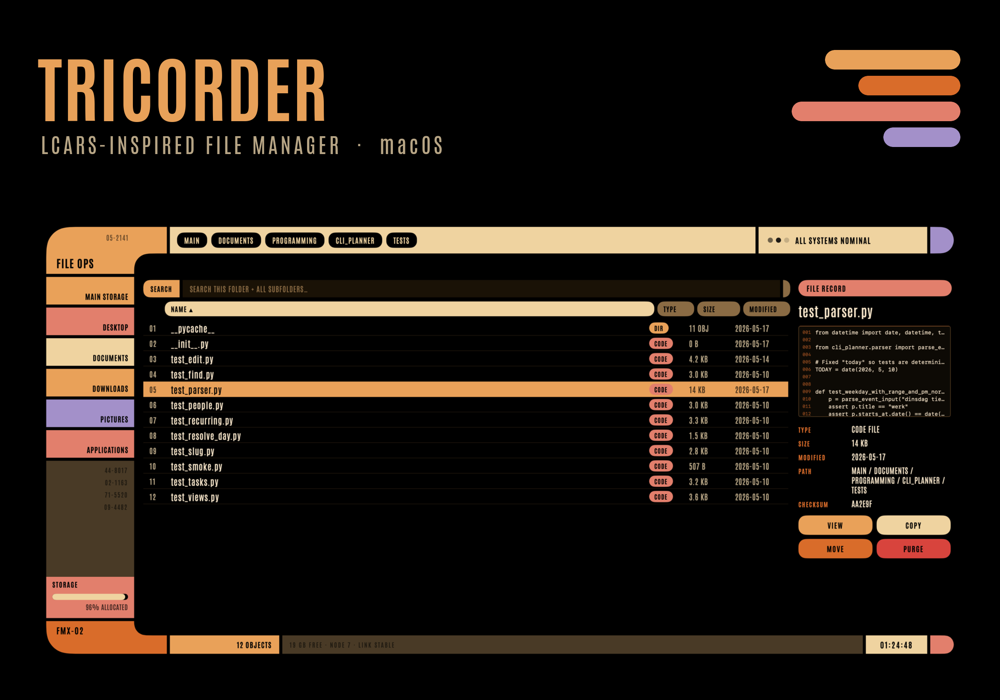

# Tricorder

<p align="center">
  
</p>

**An LCARS-inspired file manager for macOS — a homage to the *Star Trek: The Next Generation* computer interface.**

<p align="center">
  
  
  
  
</p>

As a kid I was intrugued by the LCARS computer interface on Star Trek: TNG. We had
MS DOS!, so the LCARS panels on the show looked like magic to me.
This is an homage to the Star Trek: TNG computer. Tricorder, a native macOS
file manager in the styje of an LCARS panel.

Built in **Swift + SwiftUI** (native AppKit under the hood), so it's a genuine
double-clickable `.app` — no Electron, no browser.

## What it does

- **Browse the macOS filesystem** starting from your home folder.
- **Nav rail** — quick jumps to Home, Desktop, Documents, Downloads, Pictures, Applications.
- **Breadcrumbs** (`MAIN / …`) — click any segment to jump up the tree.
- **Recursive search** — searches the current folder **and every subfolder**.
- **Sortable columns** — NAME / TYPE / SIZE / MODIFIED
- **Colour-coded type tags** — DIR / DOC / IMG / VID / AUD / DATA / CODE / DB / ARCV / APP.
- **FILE RECORD panel** — a live **preview feed** (LCARS-terminal text readout for text
  files, a thumbnail for images, plus type, real size,
  modified date, path and a name checksum
- **Behaviour toggles** (menu **Systems**): Motion (animations), Red Alert, Compact density.

## Keyboard & menus

| Shortcut | Action |
|---|---|
| ⌘F | Focus the search bar (Enter opens top hit · Esc clears) |
| ↑ / ↓ | Move selection |
| → / Return | Open folder / file |
| ← | Enclosing folder |
| ⌘O Open · ⌘C Copy · ⌘⇧M Move · ⌘⌫ Trash · ⌘⇧R Reveal in Finder | Item actions |
| ⌘[ Back · ⌘↑ Up · ⌘⇧H Home · ⌘R Refresh | Navigation |
| ⌥⌘M Motion · ⌥⌘A Red Alert · ⌥⌘D Compact | Toggles |

## Build

Targets macOS 14+ on Apple Silicon. The project builds without Xcode so a direct
compile instead:

```sh
git clone https://github.com/martinbeusker/tricorder-file-manager.git
cd tricorder-file-manager
./build.sh
open "build/LCARS Ops.app"
```

To install it, drag `build/LCARS Ops.app` into `/Applications`.

## Layout

```
Sources/LCARSOps/
  LCARSOpsApp.swift       @main App + AppDelegate + menu commands
  Theme.swift             LCARS palette, Antonio type ramp, metrics
  Model/
    FileItem.swift        file model, kind→colour mapping, formatting
    FileSystemModel.swift directory reads, navigation, sort, operations
    SearchWalker.swift    cancellable streaming recursive search
  Views/
    Components.swift      elbows, end caps, blinking dot, pill button
    TopFrame.swift        elbow + breadcrumbs + status
    NavRail.swift         quick-access rail + storage meter
    FileListView.swift    sortable header + file rows
    RecordPanel.swift     FILE RECORD detail + preview feed
    BottomFrame.swift     footer + clock
    ContentView.swift     assembles the screen + key handling
Resources/
  Fonts/                  Antonio static weights + OFL.txt
  AppIcon.png             icon source (LCARS elbow), converted to .icns at build time
```

## Typography

The LCARS lettering is set in **[Antonio](https://fonts.google.com/specimen/Antonio)**,
a free, open condensed sans by Vernon Adams, distributed by Google Fonts under the
**SIL Open Font License 1.1**. It is bundled as static weights.
## License

The **source code** of this project is released under the **MIT License** © 2026
Martin Beusker — see [`LICENSE`](LICENSE).

**On the LCARS design language:** "LCARS" and "Star Trek" are trademarks of **CBS
Studios Inc.** The LCARS look originates in *Star Trek: The Next Generation* and remains
the property of CBS Studios Inc. This project is an **unofficial, non-commercial fan
homage** to that design language. It is not endorsed by, affiliated with, or sponsored by
CBS Studios Inc. or Paramount, and **no series assets** — fonts, logos, insignia,
screenshots, or okudagram artwork — are included in this repository. The bundled Antonio
typeface is licensed separately under the SIL OFL 1.1 (above).

---

*This is a fan-made tribute created out of admiration for the design work of the
Star Trek art department. LCARS © CBS Studios Inc. All rights in Star Trek and its
elements belong to their respective owners.*
